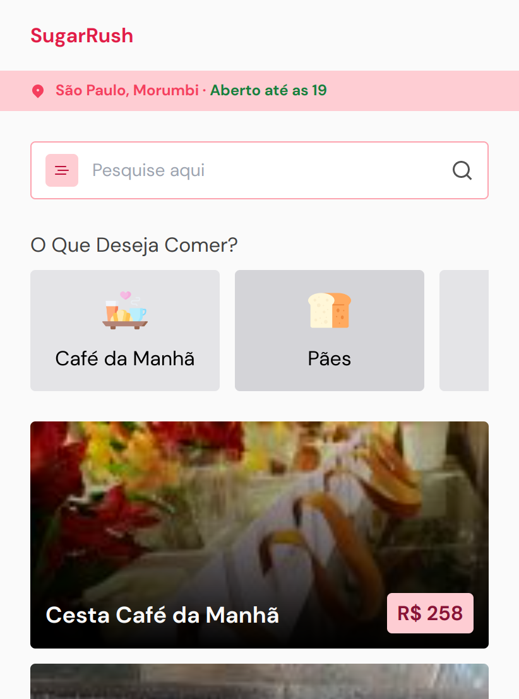
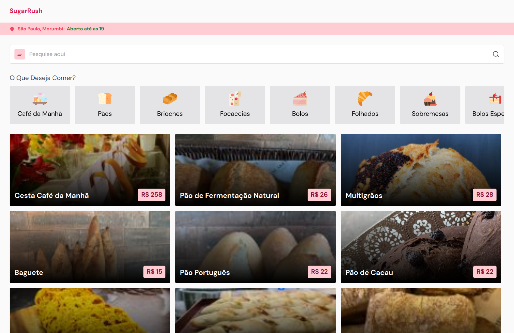

# DoctorCare

  

 

---

 

 

---

 

## Tecnologies

 

  

 

## 📝 License

This project is under the MIT license. See the [license](LICENSE.md) file for mode details.

 

## Contributors

<table>
  <tr>
    <td align="center">
      <a href="https://github.com/ThiagoThalisson">
         
        
          <b>Thiago Thalisson</b>
        
      </a>
    </td>
  </tr>
</table>

 

## **Creator**

My name is [Vitor Gouveia](https://github.com/VitorGouveia), I am a 17 year old developer who really likes to create apps using over-engineered tech stacks.

### **Contact**

If you want to get in contact with me, here are my social media:

